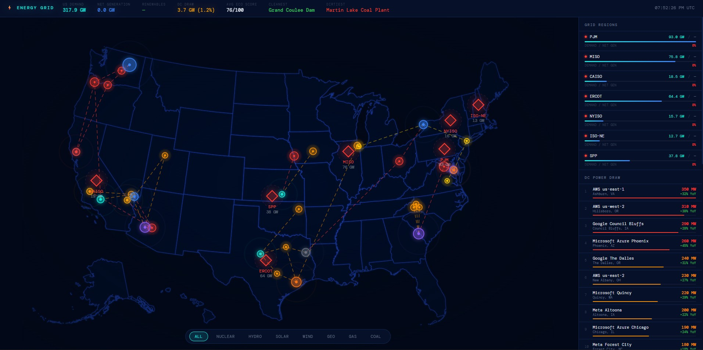

# Energy Grid

A live interactive visualization of the US power grid — real demand data, power plant locations, hyperscale data center draw, and energy flow. Built with React and the EIA Open Data API.

**[Live Demo →](https://energy-grid-bay.vercel.app)**



## What it shows

- **Live regional demand** — 7 RTOs (PJM, MISO, CAISO, ERCOT, NYISO, ISO-NE, SPP) with near real-time MW demand
- **Power plant markers** — 15 real US plants sized by capacity, colored by fuel type
- **Hyperscale data center draw** — 20 facilities ranked by energy consumption (AWS, Google, Meta, Microsoft)
- **Energy flow lines** — plant-to-datacenter connections on the map
- **National fuel mix** — solar, wind, hydro, nuclear, gas, coal breakdown
- **Eco scores** — carbon intensity ratings per plant with SVG arc gauges

## Interactions

| Action | Result |
|--------|--------|
| Click a region diamond | 24h demand + net generation chart in sidebar |
| Click a power plant | Highlights its connected data centers, dims everything else |
| Click a data center | Highlights its source plants and flow lines |
| Hover a flow line | Shows plant → DC power draw |
| `ESC` | Clears selection |
| Filter buttons | Show/hide plants by fuel type |

## Stack

- **React + Vite** — app shell and data loading
- **react-simple-maps** — SVG US map with custom glow filters
- **Recharts** — 24h area chart in the detail panel
- **EIA API v2** — live electricity demand, generation, and fuel mix data

## Setup

**1. Get a free EIA API key**

Register at [https://www.eia.gov/opendata/register.php](https://www.eia.gov/opendata/register.php) — instant, no credit card.

**2. Clone and install**

```bash
git clone https://github.com/YOUR_USERNAME/energy-grid.git
cd energy-grid
npm install
```

**3. Add your API key**

```bash
cp .env.example .env
# Edit .env and replace your_key_here with your actual EIA API key
```

**4. Run**

```bash
npm run dev
```

Open [http://localhost:5173](http://localhost:5173).

## Data notes

- **Demand** (D type) is near real-time — ~1h lag
- **Net generation** (NG type) lags ~24h — dashes in the UI are expected
- **Fuel mix** is US-wide, sourced from the `US48` respondent
- Plant generation figures are monthly averages converted to average MW

## Project structure

```
src/
  api/eia.js          — EIA fetch helpers and REGIONS constant
  data/plants.js      — 15 real plants with EIA IDs and eco scores
  data/dataCenters.js — 20 hyperscale DCs with modeled metrics
  components/
    GridMap.jsx        — SVG US map, markers, flow lines, highlighting
    DetailPanel.jsx    — Region click: 24h Recharts demand chart
    FuelMixPanel.jsx   — National fuel mix stacked bar
    RegionPanel.jsx    — RTO demand/netGen rows
    DcRankings.jsx     — DCs ranked by power draw
    EcoPanel.jsx       — Plants sorted by eco score with arc gauges
  App.jsx             — Data loading, selection state, layout shell
  index.css           — Design tokens and all global styles
```

## License

MIT
